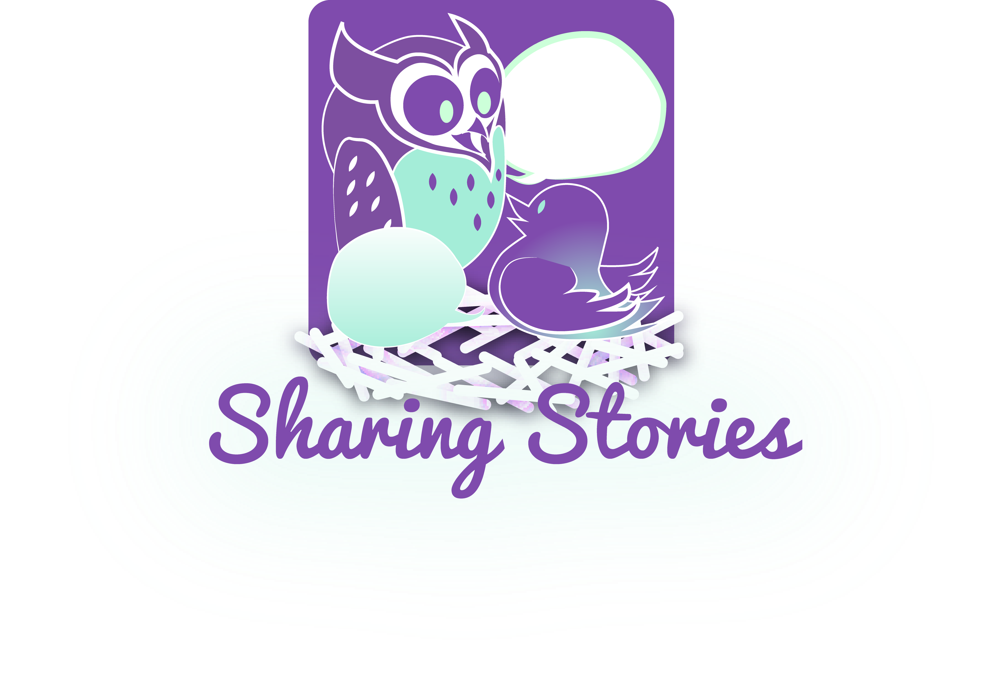

# Sharing_Stories
This is a project I completed with a small team for <a href="https://hacking-health.org/event/hackathon-finale-showcase-hhwaterloo/">Hacking Health during June of 2019</a>.
The theme of the hackathon was to create smart solutions for addressing issues accessibility and social isolation for an aging population. Our team project was called Sharing Stories, a program that would partner with local communities, organizations, and schools to connect older generations to younger ones. Building up relations through an intuitive search & scheduling on a video chat platform that would empower users to pair with others of similar interests. Older generations would feel better connected within their community and younger ones could gain new insights. 

I designed the logo for the project, deliberated with my team on it's the scope and directio, and assisted in building the final user interface mock up. To learn more, you can download the slide deck of our detailed pitch <a href="SharingStories_Pitch.pptx">here<a>.

